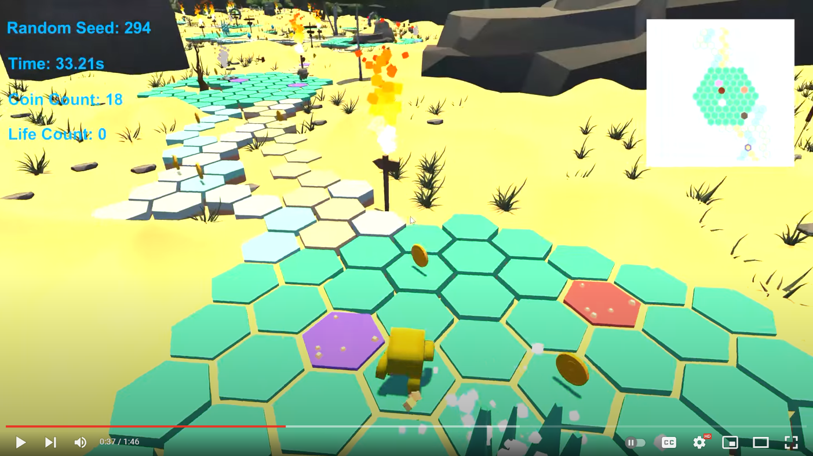
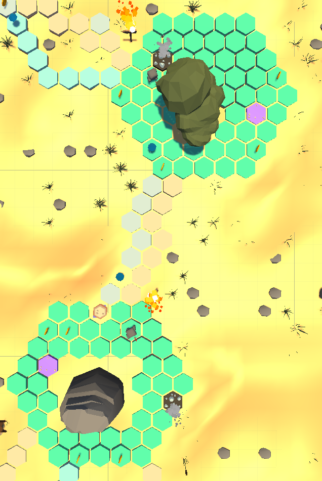
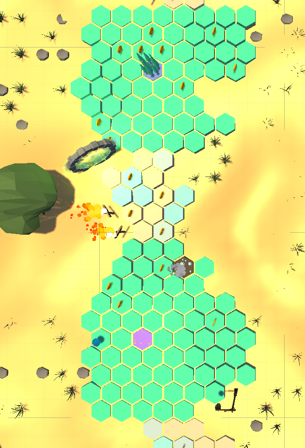

Hexagon-Running-Game-Unity
=====================================
**Kehan Xu ([LinkedIn](https://www.linkedin.com/in/kehan-xu-356139159/) | [Github](https://github.com/Fiona730) | [Personal Website](https://fiona730.github.io))**

This is a running game with running paths formed by hexagons, designed made by myself with Unity. The project is constructed with the idea of **"procedural content generation"** in mind. Actually, everything in the scene is generated automatically based solely on a user input random integer, including the hexagon path as well as the plants, rocks and the terrain. In other words, changing the random seed will lead to a completely different parkour path and environment, which stimulates the player's interest in keeping playing the game.

Tested on personal laptop:
* Windows 11 x64, AMD Ryzen 9 5900HS @ 3.30 GHz 32GB
* RTX 3080 Laptop 8GB

## Table of Contents
[Demo Video](#demo-video)

[Procedural Scene Generation](#procedural-scene-generation)

[Features](#features)

[Install and Play Instructions](#install-and-play-instructions)

[Third-Party Credits](#third-party-credits)

<a name="demo-video"/> 

## Demo Video (Click to Watch)

(Also on [bilibili](https://www.bilibili.com/video/BV1fZ4y1K7r8/), a Chinese video site.)

<a name="procedural-scene-generation"/> 

## Procedural Scene Generation

<i>The scene from the user's view.</i>

<i>Bird's-eye view of the constructed path and scene.</i>

<i>Scene construction walkthrough.</i>

This section describes the details of scene construction from a random seed. See the graph above for a visual demonstration.

In a rectangle area with pre-defined size, we consider to form the full running trail with different islands and paths sequentially connecting these islands. As the basic building block of our paths is hexagon, it is straightforward to model islands as large hexagon shapes formed by varying number of hexagon units. Therefore, in step one we randomly place hexagon groups with different size in the given area. A few irregular shapes are also placed to add variety.

| Hexagon Shape Islands  | Irregular Shape Islands     |
|------------------------|-----------------------------|
|  |  |

In the second step, we sort these large hexagons according to their relative positions along the longer edge of the rectangle, and form connection subpaths sequentially. Each such path connects the center of two neighbouring hexagons, but I also split it into multiple roads and add noise perturbation to make it more challenging.

 

<i>Different hexagon colors represent a separate subpath. Discontinuity due to multiple subpaths covering the same hexagon.</i>

After the rough path construction, we start to construct the scene. In step three, we create holes inside each island and randomly insert a scene object mesh into it. Meshes are selected from a pre-defined list of objects (mostly trees and wood railings), with the number of hexagon units they occupy known. Holes within islands also adds more challenge and thrill to the running trail, making running straight through hexagons groups impossible.

 

<i>Holes placed with trees inside islands.</i>

The final step builds the rest of the scene by adding terrain and landscape objects outside the parkour path. The terrain is generated by representing height map with [Perlin noise](https://en.wikipedia.org/wiki/Perlin_noise). A yellow tone is used to mimic the texture of sand (now I look at it, this is soooo unrealistic lol). Small rocks and grasses are placed onto the terrain and adjusted to match the local terrian height, so that they appear on the surface; a small variation in height is also presented to create varying coverage of sand over the objects. Other larger-scale meshes are placed onto the part of the landscape where the parkour path doesn't come across.

<i>Notice the smooth height variation of the landscape.</i>

With the aforementioned four steps, we are able to construct a scene with much diversity and amusement, and the parkour path is actually quite challenging for me as an unexperienced gamer.

<a name="features"/> 

## Features

To add more fun, I implemented hexagon modules with special functionalities as well as other game mechanics.

### Hexagon Module

#### Speed Up

#### Speed Down

#### Jump

#### Bomb

#### Checkpoint

<i>Once you pass the checkpoint, you can resume running from here when restarting, no need to go from the start.  There are in total four checkpoints before reaching the endpoint.</i>

#### Endpoint

### Minimap

<i>Minimap is on the upper-right corner of the window, showing a simplified top view of the parkour path. Special hexagon modules are also labeled with eye-catching color.</i>

### Teleportation Portal

<i>The player can choose to go through the transportation portal to be transmitted forward in the map, saving more effort to reach the goal.  The camera movement between portals still needs improvement (we want the location switch to be smooth but also quick).</i>

<i>The red frames highlight a pair of portals.</i>

### Simple AI
AIs randomly reside in some islands. Each AI switch between two states: blue or grey. When user meets a grey AI, it loses and the game ends; on the other hand, collision with a blue AI can add bonus to the user's score. AIs are motivated by simple logic: when the player approaches the island, they move toward it.

<i>Left: Grey AI &nbsp;&nbsp;&nbsp; Right: Blue AI</i>

### Coins and Diamonds
User gets higher score in one round by collecting more coins and diamonds, which are placed randomly on the hexagons. Diamonds are rarer, with one of them equals the value of ten coins.

### Road Sign
Road sign with fire on its top guides the user the right direction to proceed. It is designed hoping to avoid the case where the user runs around the island and loses the direction.

<i>Here we have two road signs because one is pointing towards the road while the other towards the portal.</i>

<a name="install-and-play-instructions"/> 

## Install and Play Instructions

This program is built in Unity **2019.4.3f1** and also tested on Unity **2020.3.19f1**. Simply install any of the two versions and load the project.

The exported exe file is available on [Google Drive](https://drive.google.com/file/d/1e4FDeH4_hBjm7PyRI2QU6TFVqbJrpGMU/view?usp=sharing) (Windows only).

When entering the game, you input a random integer number to generate the scene. Then the running game starts, and you control the character to turn by pressing left / right arrow. Whenever it goes outside the path, the round fails, and you can choose to restart or start the game with a new scene.

<a name="third-party-credits"/> 

## Third-Party Credits

The inspiration of using hexagons to form parkour paths comes from the lovely game [The Little Fox](https://www.youtube.com/watch?v=l51a5742K8E).

All models come from [Unity Asset Store](https://assetstore.unity.com/).

### Reference
[Perlin noise](https://en.wikipedia.org/wiki/Perlin_noise)